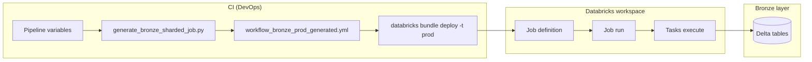
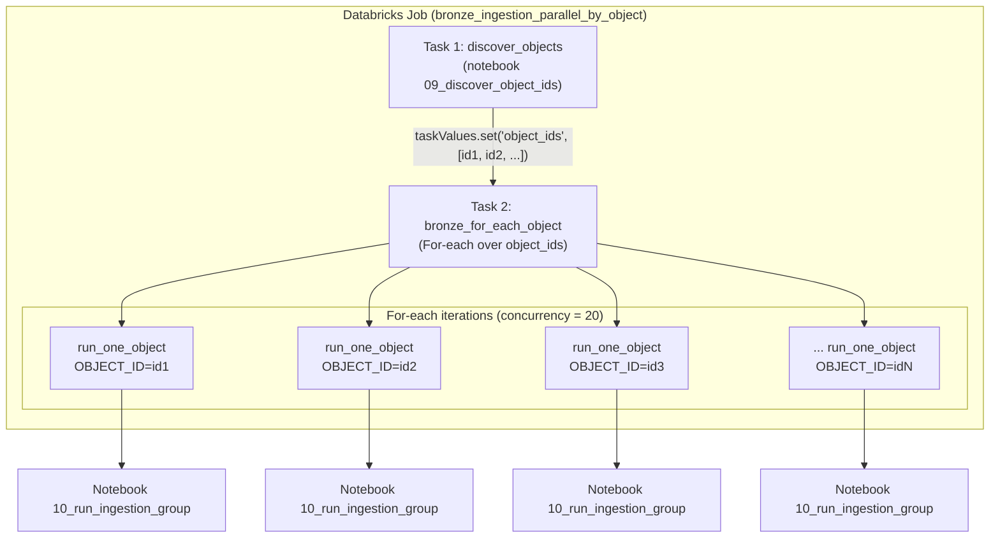
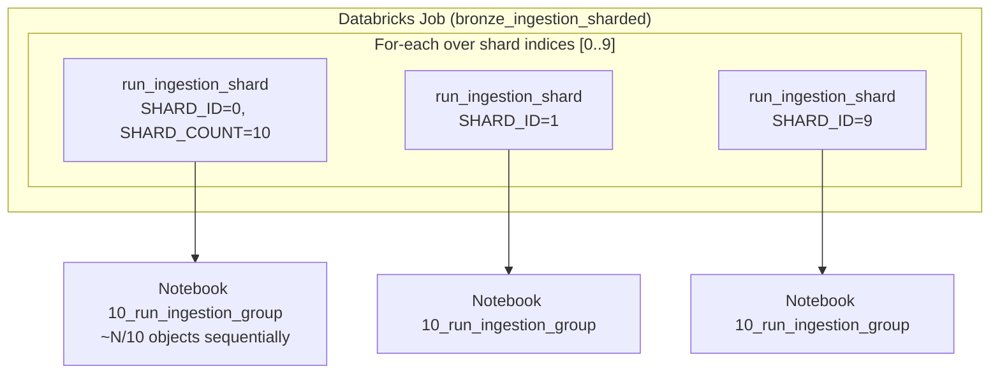
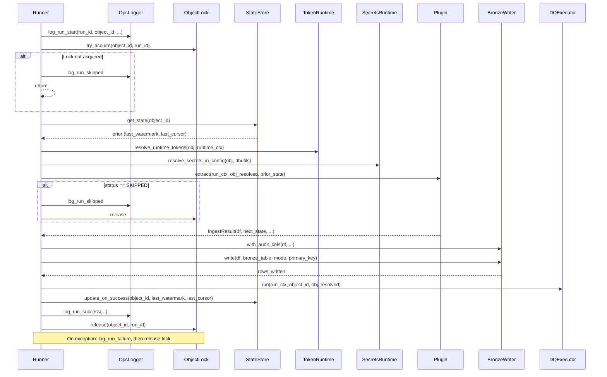
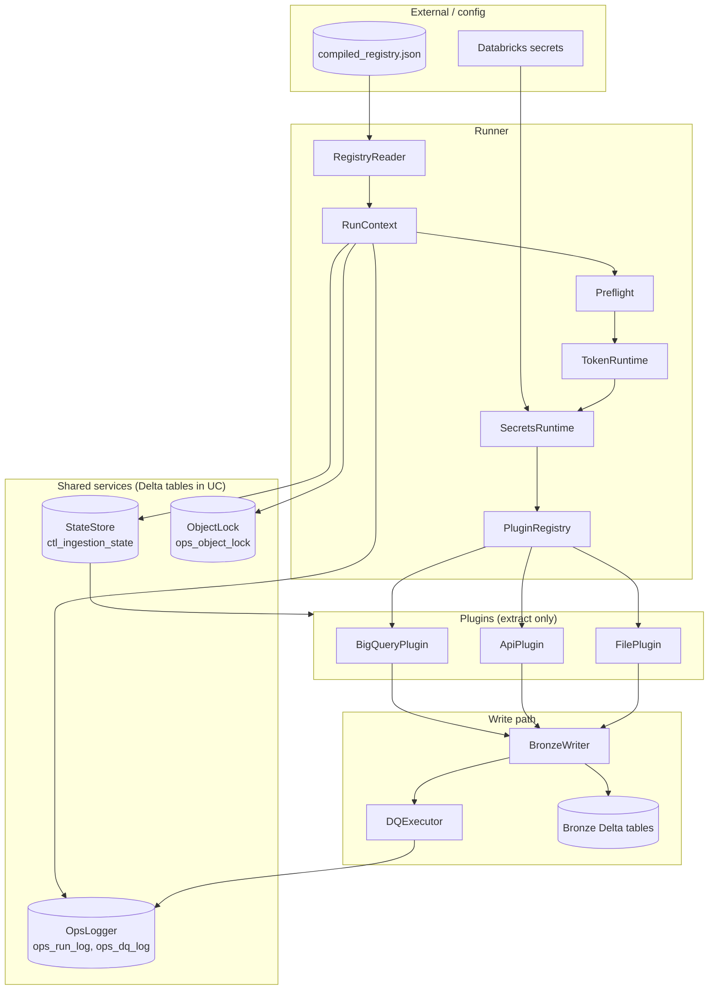

# Ingestion orchestration – component-level flow (bronze / silver / gold)

Detailed diagrammatic view of how orchestration flows from CI through the runner to layer tables. The runner is **layer-aware**: each run is for one layer (bronze, silver, or gold). Objects are filtered by `layer`; state, lock, and ops tables share a `layer` column; the writer writes to `target_table` per layer.

---

## 1. End-to-end: from CI to job run



- **Dev/test**: Static YAML in repo; developer edits or runs generator locally → deploy.
- **Prod**: CI runs generator with pipeline variables → writes job YAML → bundle deploy uses it → job runs in workspace.

---

## 2. Job structure (parallel-by-object mode)

One job run: first task discovers object IDs; second task is a For-each that runs one ingestion task per object (up to `concurrency` in parallel).



Each iteration runs the same notebook with a different `OBJECT_ID` (one object per task = full parallelism).

---

## 3. Job structure (shards mode)

One job run: one For-each over shard indices; each iteration runs the group notebook for that shard (objects inside the task run sequentially).



---

## 4. Component flow inside the runner (one task)

When a task runs (either one object or one shard’s objects), the notebook calls `run_ingestion_group`. High-level component flow:

```mermaid
flowchart TB
  subgraph Notebook["Notebook 10_run_ingestion_group"]
    W[Widgets: TARGET_ENV, SCHEDULE_GROUP, REGISTRY_PATH,<br/>OBJECT_ID or SHARD_ID/SHARD_COUNT]
    W --> R[run_ingestion_group()]
  end

  subgraph Runner["Runner (run_group.py)"]
    R --> R1[RegistryReader.load_compiled_registry]
    R1 --> R2[RunContext + StateStore, OpsLogger,<br/>BronzeWriter, DQExecutor, ObjectLock]
    R2 --> R3[build_plugin_registry: BigQuery, API, File]
    R3 --> R4[Select objects: schedule_group<br/>+ object_ids or shard filter]
    R4 --> R5[Preflight.validate_object_config]
    R5 --> R6["For each approved object:<br/>_run_one_object(...)"]
  end

  R6 --> RunOne[See diagram 5]
```

---

## 5. Per-object flow: _run_one_object (detailed)

For each approved object in the task, the runner does the following. Ops/DQ/state/lock are shared services; the plugin and writer do the actual extract and write.



---

## 6. Data and control flow (component view)

Where data lives and how it moves between components.



---

## 7. Summary table

| Layer | Component | Responsibility |
|-------|-----------|----------------|
| **CI** | Pipeline + generator | Produces job YAML from variables; triggers bundle deploy. |
| **Job** | discover_objects task | Loads registry, sets task value `object_ids` (parallel-by-object only). |
| **Job** | For-each task | Runs N copies of run notebook (by object_id or by shard_id). |
| **Notebook** | 10_run_ingestion_group | Gets widgets, calls `run_ingestion_group`. |
| **Runner** | run_ingestion_group | Loads registry, builds services, selects objects, preflight, loops _run_one_object. |
| **Runner** | _run_one_object | Lock → state → resolve → plugin.extract → write → DQ → state update → ops → release. |
| **Services** | StateStore, OpsLogger, ObjectLock | Delta tables in UC (ops schema); per object_id or run_id. |
| **Plugin** | BigQuery / API / File | Extract only: return DataFrame + next_state. |
| **Writer** | BronzeWriter | Audit columns, append/merge/overwrite to bronze Delta. |
| **DQ** | DQExecutor | Bronze checks (row_count_min, not_null, duplicates); logs to ops_dq_log. |

These diagrams can be rendered in GitHub, Azure DevOps (Wiki or pipeline summary), or any Markdown viewer that supports Mermaid (e.g. VS Code with Mermaid extension).
